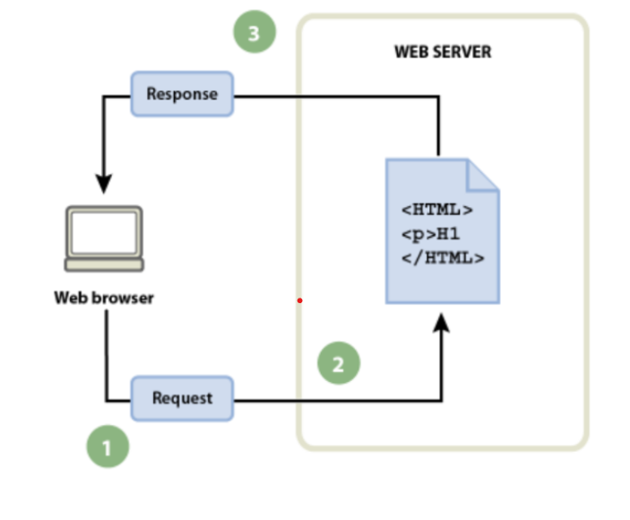

# Apuntes-de-MarkDown

Evaluación inicial

1. ¿Qué es una página web?
Es un conjunto de información y archivos accesibles por la red programadas por un lenguaje.
2. ¿Qué es un sitio web?
Es un espacio virtual donde estan las páginas webs las cuales contienen archivos donde comparten información.
3. ¿Qué es una apliacicón web?
Es un software que ejecuta en el navegador en web.
4. ¿Qué es una herramienta ofimática?
Es un programa que ayuda en colocar información y optimizar funciones diarias en las oficinas.
5. Herramienta de Google:

|Aplicaciones|Visto|
|----------|-----------------|
|Google Docs|[!(https://github.com/JuanjGomez/Apuntes-de-MarkDown/blob/main/google-docs-trucos-si-o-si-1200x800.jpg.jpeg)]|
|Google Slides|[!(https://github.com/JuanjGomez/Apuntes-de-MarkDown/blob/main/Google_Slides_2020_Logo.svg.png)]|
|Google Sheets|[!(https://github.com/JuanjGomez/Apuntes-de-MarkDown/blob/main/images.jpeg)]|
|Google Calendar|[!(https://github.com/JuanjGomez/Apuntes-de-MarkDown/blob/main/1366_2000.jpg)]|
|Google Meet|[!(https://github.com/JuanjGomez/Apuntes-de-MarkDown/blob/main/GOOGLE-MEET.jpeg)]|

6. ¿Qué es HTML?
Es un codigo que se utiliza para estructurar páginas webs.

```
<html>
 <!DOCTYPE html>
 <html lang="en">
 <head>
    <meta charset="UTF-8">
    <meta http-equiv="X-UA-Compatible" content="IE=edge">
    <tittle>Document</title>
 </head>
 <body>

 </body>
 </html>
<html>
```

7. ¿Qué es CSS?
Es un lenguaje qeu ayuda en ordenar diferentes estrucciones a un sitio web y dar un mejor contenido al formato de la página web.

8. Flujo de trabajo (navegador, petición, servidor y respuesta):
